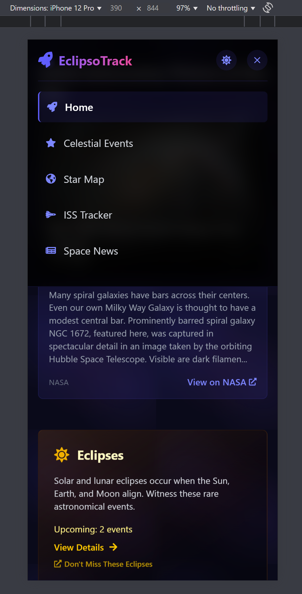
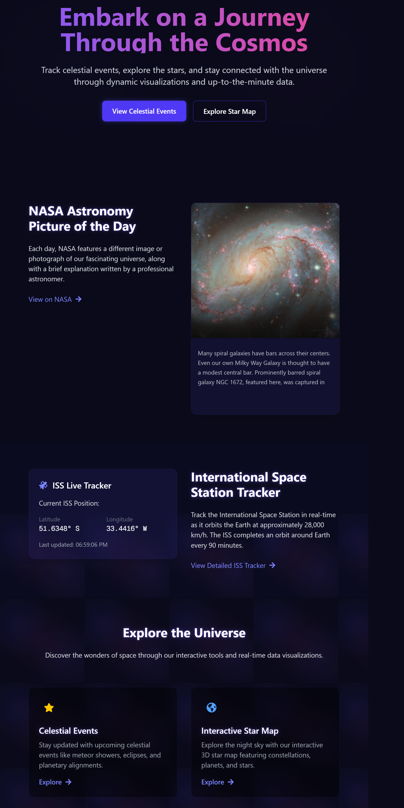
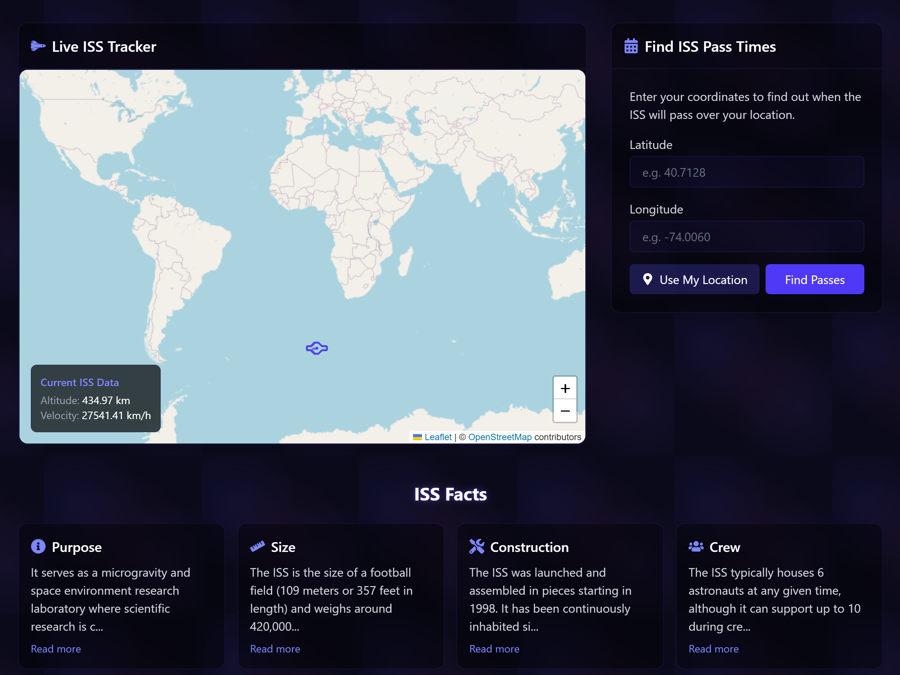
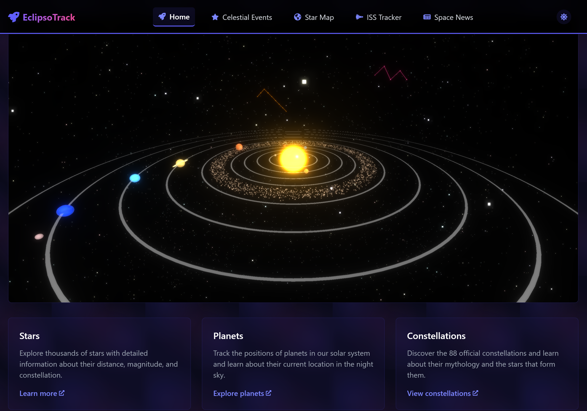
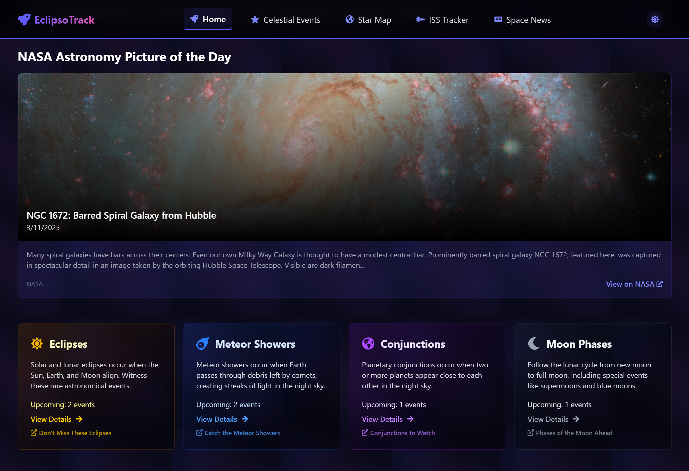

# EclipsoTrack - Celestial Event & Astronomical Tracker 🌌

EclipsoTrack is an immersive web application designed to provide real-time tracking, visualization, and detailed insights into celestial events, planetary positions, and space phenomena. With features like an interactive 3D star map, live ISS tracking, and space news, EclipsoTrack brings the wonders of the cosmos to your fingertips. Whether you're an avid stargazer or a curious space enthusiast, EclipsoTrack offers a captivating experience for all.

## ✨ Features

### 1. Celestial Event Tracking
Never miss a cosmic event again! 🌒  
- Track upcoming solar and lunar eclipses, meteor showers, planetary conjunctions, and more—all in real-time. 🌟

### 2. Interactive 3D Star Map
Travel through the stars without leaving your chair! 🌠  
- Zoom, rotate, and pan across the night sky to explore stars, planets, and constellations. 🪐  
Use your mouse to navigate—rotate to explore, scroll to zoom in or out, and drag to move around. 🖱️

### 3. Live ISS Tracking
Watch the International Space Station zoom by in real-time! 🚀  
- See its position, altitude, velocity, and orbital path as it orbits Earth at 28,000 km/h. 🌍  
The ISS orbits Earth every 90 minutes, so there's always something to track! 🔄

### 4. Space-Themed User Interface
Immerse yourself in the cosmos with a sleek, dark interface that’s out of this world! 🌌  
- Animated celestial elements create a mesmerizing experience on desktop, tablet, and mobile. 📱  
Personalize color schemes and adjust animation intensity to match your cosmic vibe. 🎨

### 5. Astronomy News Feed
- Stay in the loop with the latest in space exploration and astronomy! 🛸   
Our feed brings you the freshest space news, from new discoveries to mission updates, all curated from trusted sources like NASA. 📰

### 6. Leading Space Agencies
Get the latest from the space industry’s pioneers! 🌍    
- NASA 
- SpaceX  
- Blue Origin
- China National Space Administration
- Virgin Galactic
- European Space Agency
- Arianespace

### 7. NASA Astronomy Picture of the Day
- Feast your eyes on a new cosmic image every day, straight from NASA! 📸  
Each image comes with a professional astronomer’s explanation, offering a deeper look into the universe’s mysteries. 🌌

---

## 🚀 Technologies Used

### Frontend
- **Next.js & React.js**: Built with Next.js App Router for server-rendered pages.
- **TypeScript**: Static typing for code reliability.
- **Tailwind CSS**: Utility-first CSS framework.
- **Framer Motion**: Smooth animations and transitions.

### 3D Visualization
- **Three.js** serves as the primary 3D graphics library.
- **WebGL** drives the rendering process through Three.js.

### Data & APIs
- **NASA API**: Space imagery and event data.
- **AstronomyAPI**: Celestial object positions.
- **Open Notify API**: Real-time ISS tracking.
- **Axios**: Data fetching and caching.

### Mapping
- **Leaflet & React Leaflet**: Interactive maps for ISS paths.

## 🛠️ Getting Started

### Prerequisites
Before getting started, make sure you have the following installed and configured:

- **Node.js** (v18 or higher)  
  Ensure you have the latest LTS version of Node.js. You can download it from [here](https://nodejs.org/).

- **Package Manager**: Choose one of the following:
  - **npm** (comes with Node.js)
  - **yarn** (alternative to npm, install from [here](https://yarnpkg.com/))

- **API Keys**:
  - **NASA API Key**: Sign up at [NASA API](https://api.nasa.gov/) to get your personal API key for access to space imagery, data, and events.
  - **AstronomyAPI Key**: Register at [AstronomyAPI](https://astronomyapi.com/) for celestial object positions and astronomical data.
  - **Open Notify API**: Sign up for a key at [Open Notify API](https://publicapi.dev/open-notify-api) to get real-time ISS tracking data.
  - **NewsAPI Key**: Get access to the latest space-related news by signing up at [NewsAPI](https://newsapi.org/).

- **Development Environment**:
  - **Code Editor**: Recommended code editors are [Visual Studio Code](https://code.visualstudio.com/) or [JetBrains WebStorm](https://www.jetbrains.com/webstorm/).
  - **Git**: Ensure you have Git installed for version control. You can get it [here](https://git-scm.com/).

- **Additional Libraries**:
  - **axios**: A promise-based HTTP client used for API requests.

---

## Setup Guide

This guide will walk you through the process of setting up the EclipsoTrack App using Next.js, React, TypeScript, and Three.js.

### 1. Clone the Repository

First, clone the repository to get started:
```bash
git clone https://github.com/binayakbartaula11/eclipso-track.git
```

Navigate to the project directory:
```bash
cd eclipso-track
```

### 2. Install Core Dependencies

To set up the core dependencies for Next.js, React, TypeScript, and Three.js, run the following command:
```bash
npm install next react react-dom typescript
```

**Alternative**: Use `pnpm`

If you prefer to use pnpm, which is a fast and efficient package manager, you can install the dependencies with the following command:
```bash
pnpm install next react react-dom typescript
```
*(Note: If you create a Next.js project using Create Next App, these dependencies are automatically installed, so you won't need to manually run the commands above.)*

### 3. API Key Setup

1. Create a `.env.local` file (if it doesn't already exist) in the root directory of your Next.js project.

2. Add your API keys to the .env.local file for the respective APIs. You can store each API key as an environment variable in this format:
```env
NEXT_PUBLIC_NASA_API_KEY=<your-nasa-api-key>
NEXT_PUBLIC_ASTRONOMY_API_KEY=<your-astronomyapi-key>
NEXT_PUBLIC_NOTIFY_API_KEY=<your-notify-api-key>
NEXT_PUBLIC_NEWS_API_KEY=<your-newsapi-key>
```

**Explanation:**
- *`NEXT_PUBLIC_`*: This prefix is necessary in Next.js for any environment variable that needs to be accessible on the client side. Without this prefix, the variable will only be available on the server side.
- Replace `<your-nasa-api-key>`, `<your-astronomyapi-key>`, `<your-notify-api-key>`, and `<your-newsapi-key>` with the actual keys you get from each service.

### 4. Install Additional Dependencies

You will need the following dependencies to integrate Three.js, and API calls for NASA API, AstronomyAPI, and ISS Tracker:
```bash
npm install three axios react-helmet
```

**Alternative**: Use `pnpm`
```bash
pnpm install three axios react-helmet
```

This will install the following key packages:

- `three`: Three.js library for 3D rendering.
- `axios`: For making API requests.
- `react-helmet`: For managing the document head (useful for dynamic title, meta tags, etc.).

### 5. Install Development Tools

For better code quality and consistent formatting, install ESLint and Prettier:
```bash
npm install --save-dev typescript eslint prettier @typescript-eslint/eslint-plugin @typescript-eslint/parser eslint-config-prettier eslint-plugin-prettier
```

### 6. Running the Development Server

To start the development server:
```bash
npm run dev
```
This will launch the application locally at http://localhost:3000, offering a fast and efficient development environment.

## Development Flow

The project is structured for a seamless and efficient development experience. Modify files within their respective directories, and leverage Next.js’s fast refresh for instant updates, ensuring a fast and interactive workflow.

### Key Points

- **Source Code**: The core application logic is organized across several directories:
  - **`src/app/`**:
    - Contains the Next.js App Router directory for managing pages and the main layout.
  - **`src/components/`**:
    - Houses reusable UI components such as event cards, headers, footers, and interactive maps.
  - **`src/hooks/`**:
    - Contains custom React hooks for features like fetching real-time data and managing application state.
  - **`src/lib/`**:
    - Manages utility functions, including data formatting and external API integrations.
  - **`src/services/`**:
    - Handles API calls to external sources, such as NASA, ISS, and Astronomy APIs.
  - **`src/types/`**:
    - Defines TypeScript types for better code safety and consistency.

- **Fast Development**: Next.js’s fast refresh ensures that any modifications in components, styles, or logic are instantly reflected in the browser without requiring a full reload.

- **Real-time Data**: The app makes use of live data from various APIs to provide up-to-date celestial events, ISS tracking, and astronomical information.

- **Interactive UI**: The integration of Three.js offers an engaging, interactive 3D experience with star maps.

---

## File Structure

```graphql
eclipso-track/  
│-- .github/                    # Contains GitHub workflows and CI/CD configurations  
│-- .next/                      # Build output directory generated by Next.js  
│-- node_modules/               # Installed dependencies from npm/yarn  
│-- public/                     # Static assets like images, icons, and fonts  
│-- src/                        # Main source code directory  
│   │  
│   ├── app/                    # Next.js App Router directory for managing pages   
│   │   ├── celestial-events/   # Section for celestial events information  
│   │   │   ├── [id]/           # Dynamic route for individual celestial event details  
│   │   │   │   ├── page.tsx    # Page displaying specific celestial event details  
│   │   │   ├── page.tsx        # Page listing all celestial events  
│   │   ├── iss-tracker/        # Section for tracking the International Space Station (ISS)  
│   │   │   ├── page.tsx        # Page displaying ISS tracking details  
│   │   ├── news/               # Section for space-related news and updates  
│   │   │   ├── page.tsx        # Page listing space news articles  
│   │   ├── star-map/           # Section for interactive star map visualization  
│   │   │   ├── page.tsx        # Page displaying the interactive star map
│   │   │ 
│   │   ├── globals.css          # Global styles applied across the entire application
│   │   ├── layout.tsx           # Main layout component defining the page structure  
│   │   ├── page.tsx             # Main homepage of the application         
│   │  
│   ├── components/             # Reusable UI components for the application  
│   │   ├── celestial-events/   # Components related to celestial events  
│   │   │   ├── EventCard.tsx   # Displays an event in a card layout  
│   │   │   ├── EventModal.tsx  # Modal for showing event details  
│   │   ├── iss-tracker/        # Components related to ISS tracking  
│   │   │   ├── ISSMap.tsx      # Displays a map with the ISS live location  
│   │   │   ├── SimpleIssTracker.tsx # Basic version of the ISS tracker  
│   │   ├── layout/             # Layout components shared across multiple pages  
│   │   │   ├── Footer.tsx      # Footer section of the application  
│   │   │   ├── Header.tsx      # Header navigation bar  
│   │   │   ├── Layout.tsx      # Main layout wrapper for the application  
│   │   ├── nasa/               # Components for NASA-related features  
│   │   │   ├── NasaApod.tsx    # Component displaying NASA's Astronomy Picture of the Day  
│   │   ├── star-map/           # Components for the interactive star map  
│   │   │   ├── InteractiveStarMap.tsx # Renders the interactive star map visualization  
│   │   ├── ui/                 # Small reusable UI components  
│   │   │   ├── IssLocationPreview.tsx # Displays a preview of ISS location  
│   │   │   ├── NasaApod.tsx    # Displays a preview of NASA's Astronomy Picture of the Day  
│   │  
│   ├── lib/                    # Utility functions and helper libraries  
│   │   ├── nasa-api.ts         # Functions to fetch data from NASA's API  
│   │  
│   ├── services/               # API services to interact with external data sources  
│   │   ├── astronomyApi.ts     # Handles API calls for astronomical data  
│   │   ├── issApi.ts           # Fetches real-time data for ISS tracking  
│   │   ├── nasaApi.ts          # Fetches data from NASA's APIs  
│   │  
│   ├── types/                  # TypeScript type definitions for the project  
│   │   ├── index.ts            # Centralized type declarations  
│-- .env.example                # Example environment variables file  
│-- .env.local                  # Local environment variables file (ignored in Git)  
│-- .env.local.example          # Example of how to structure local environment variables  
│-- .eslintrc.json              # ESLint configuration file for enforcing code quality  
│-- .gitignore                  # Specifies files and directories to ignore in Git  
│-- eslint.config.mjs           # ESLint module configuration file  
│-- next-env.d.ts               # TypeScript definitions for Next.js environment variables  
│-- next.config.js              # Next.js configuration file written in JavaScript  
│-- next.config.ts              # Next.js configuration file written in TypeScript  
│-- package-lock.json           # Dependency lock file for ensuring consistency  
│-- package.json                # Project metadata and dependencies  
│-- postcss.config.mjs          # Configuration file for PostCSS (CSS processing)  
│-- tsconfig.json               # TypeScript configuration file  
```
---

## Project Initialization

### Resetting the Project

To restore the project to its default state, run the following command:

```bash
npm run reset
```
This will:
- Move the existing code to a backup folder (`src-example`).
- Create a new, empty `src` directory, giving you a clean slate for fresh development.

**Creating a New Project**

If you'd like to start a new project from scratch, follow these steps:

**Next.js Setup**

To create a new Next.js project with React and TypeScript, run:
```
npx create-next-app@latest eclipso-track --typescript
```

**Setup Process**

1. **Project Name:** Replace `eclipso-track` with your desired project name.
2. **TypeScript**: The --typescript flag automatically sets up TypeScript for the project.
3. **Package Manager:** Select `npm`, `yarn`, or `pnpm` based on your preference.

Once the setup is complete, navigate to your project directory:

```bash
cd eclipso-track
```
You're now ready to start developing your **eclipso-track** project!

---

## Development 🖥️

### Key Scripts

- `npm run dev`: Start development server.
- `npm run build`: Build for production.
- `npm run start`: Launch production server.
- `npm run lint`: Run ESLint to check for code quality issues.
- `npm run test`: Execute tests.

## Coding Standards 📏

- **TypeScript**: For type safety and better maintainability.
- **ESLint & Prettier**: For code consistency and formatting.
- **Component-based Architecture**: Using React hooks for building reusable and modular components.
- **Tailwind CSS**: For utility-first styling and responsive design.

---

## Live Demonstration 🌐

Ready to explore the cosmos like never before? Dive into the live version of **EclipsoTrack** at [Explore Demo](https://eclipso.netlify.app). Track **celestial events**, view **planetary alignments**, and immerse yourself in real-time space phenomena. Get live updates on **eclipses**, **meteor showers**, and **ISS** tracking, all displayed through an interactive 3D star map. 

Don’t just gaze at the stars—experience them in real-time! 🚀✨

---

## Screenshots 📱

| **Mobile View**  | **Landing Page**   |
|------------------|------------------|
|  |  |
| **ISS Tracker**  | **Star Map**  |
|  |  |
| **Space News** | **Celestial Events** | 
|   |    |

---

## Project Video 🎥

Here is a video demonstrating the features of the project:

### YouTube Video:

[Watch the Project Video on YouTube](https://youtu.be/4WnIcZHOMGs)

---

## License 📝  

Licensed under the MIT License. See [LICENSE](LICENSE) for details.

---

## Acknowledgements 🤝

This project has been built **brick by brick**, and I would like to express my deepest gratitude to the incredible organizations and technologies that have made **EclipsoTrack** possible:

- **NASA**: For providing open APIs that have allowed me to bring the wonders of space to users around the world.  
- **AstronomyAPI**: For offering precise and detailed celestial calculations, which power the real-time tracking of stars and events. 
- **Open Notify**: For supplying the ISS data that enables real-time tracking of the International Space Station as it orbits our planet. 
- **Three.js**: For providing the 3D visualization tools that help bring the universe to life in an interactive and engaging way.  
- **Next.js Team**: For creating a powerful and flexible framework that has ensured top-notch performance and a seamless user experience. 

Built with ❤️ and a profound passion for space exploration, this project is dedicated to fellow stargazers and cosmic enthusiasts around the globe.

---

## Developer's Reflections

For a more in-depth look at the personal journey behind EclipsoTrack, check out the [Developer's Reflections](REFLECTIONS.md).

---

## Learn More

### Vite, Next.js, and TypeScript Resources

For in-depth knowledge on Vite, Next.js, and TypeScript, refer to the following:

- **[Vite Documentation](https://vite.dev/)**: Core concepts, features, and integration with React and TypeScript.
- **[Next.js Documentation](https://nextjs.org/docs)**: Learn about SSR, static site generation, API routes, and TypeScript integration in Next.js.
- **[React Documentation](https://reactjs.org/docs/getting-started.html)**: Build interactive UIs with React and integrate TypeScript for better tooling and type safety.
- **[TypeScript Documentation](https://www.typescriptlang.org/docs/)**: Official guide covering setup, type inference, generics, and more.
- **[Next.js + TypeScript Template](https://github.com/vercel/next.js/tree/canary/examples/with-typescript)**: Get started with Next.js and TypeScript in one easy setup.
- **[Vite + React Template](https://github.com/vitejs/vite/tree/main/packages/create-vite/template-react)**: Create a Vite-powered React app with TypeScript for faster development.

---

### Vite + Next.js + TypeScript Setup

While Next.js uses Webpack by default, you can integrate **Vite** as a bundler for faster development. Here's a basic outline:

1. **Install Dependencies**: Install Vite, TypeScript, and relevant plugins.
2. **Configure Vite**: Modify the Next.js configuration to use Vite instead of Webpack, ensuring compatibility with SSR (Server-Side Rendering).
3. **Use TypeScript**: Both Vite and Next.js support TypeScript, enabling enhanced development features and type safety.

> **Note**: This requires manual configuration, as Vite isn’t the default bundler for Next.js. Check for community guides for more insights.

---

## Join the Community

Get involved in the Vite, Next.js, TypeScript, and React ecosystems:

- **[Vite GitHub](https://github.com/vitejs/vite)**: Contribute and explore the open-source Vite project.
- **[Next.js GitHub](https://github.com/vercel/next.js)**: Engage with the Next.js community and learn about TypeScript integration.
- **[React GitHub](https://github.com/facebook/react)**: Contribute to React and discover TypeScript integration tips.
- **[TypeScript GitHub](https://github.com/Microsoft/TypeScript)**: Contribute to TypeScript and engage in discussions.
- **[Vite Discord](https://discord.com/invite/vitejs)**: Join the Vite Discord for discussions and support.
- **[Next.js Discord](https://discord.com/invite/nextjs)**: Engage with the Next.js community for support.
- **[React Support](https://reactjs.org/community/support.html)**: Find React-related help, including TypeScript guidance.
- **[TypeScript Community](https://www.typescriptlang.org/community)**: Explore forums and events dedicated to TypeScript.

---

## Conclusion

Although there is no official **Next.js + TypeScript + Vite Template**, integrating Vite with Next.js offers performance improvements and a faster development experience. With some custom configuration, you can enjoy the benefits of Vite in a Next.js TypeScript project, especially for large-scale applications.

---
